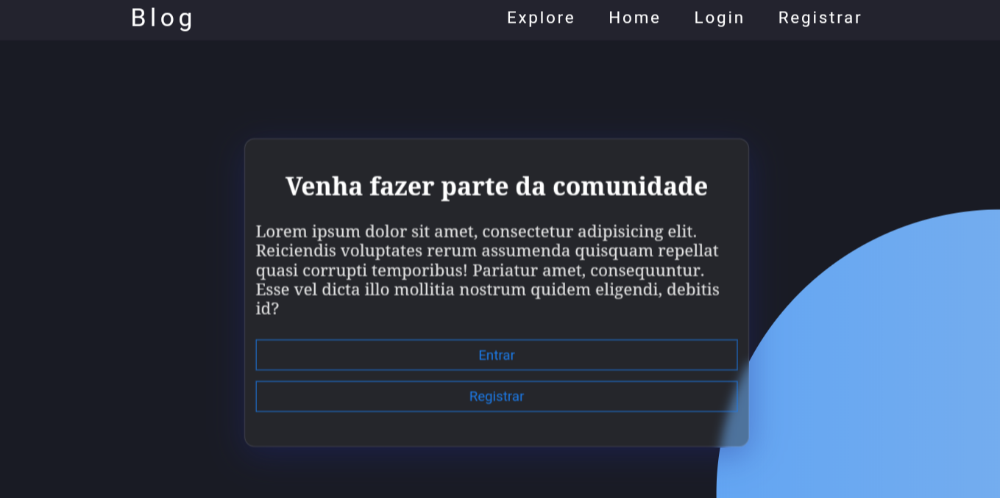
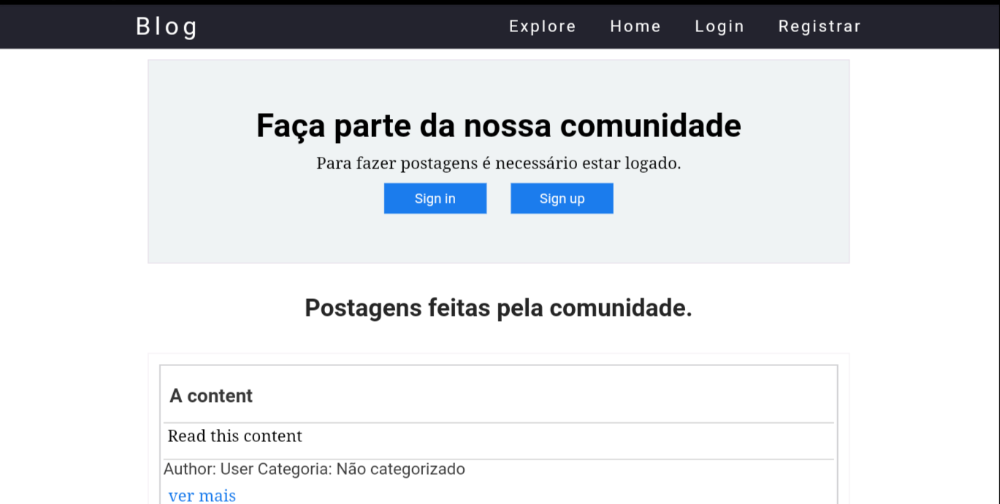

# Blog CRUD
Este crud foi feito com nodejs e com base no conhecimento aprendido no ["Curso de Node.js"](https://youtube.com/playlist?list=PLJ_KhUnlXUPtbtLwaxxUxHqvcNQndmI4B) do Victor lima.

## Overview

`Rota principal:`

`Rota explorer`

_Teste o crud para ver mais as rotas..._

## Rotas

- `/`
- `/explore`: rota para explorar os posts feitos
- `/post/view/:id`: rota utilizada para a vizualização de um post
- `/post/search`: pesquisar posts

### Rotas de usuário

- `/user/login`: fazer login
- `/user/register`: registrar-se

> Gerenciamento de conta

- `/user/acount`: sessão de administração da conta
- `/user/account/auth/`: verificação para executa certas ações
- `/user/account/delete`: apagar conta
- `/user/account/changes`: trocar nome, senha ou email do usuário
- `/user/logout`: sair da conta

> Rotas de postagem

- `/user/post/add`: criar post
- `/user/post/delete`: apagar post
- `/user/post/edit`: editar post

### Rotas de administração

- `/admin`: painel de administração

> Gerenciamento de categorias

- `/admin/categories`: gerenciamento de categorias
- `/admin/categories/add`: criar nova categoria
- `/admin/categories/edit`: editar categoria
- `/admin/categories/delete`: deletar categoria

> Gerenciamento de postagens

- `/admin/posts`: gerenciamento de postagens
- `/admin/posts/search`: pesquisar postagens
- `/admin/posts/delete`: deletar post
- `/admin/posts/edit`: editar postagens

> Gerenciamento de usuários

- `/admins/users`: gerenciamento de usuários
- `/admin/users/delete`: deletar usuários cadastrados
